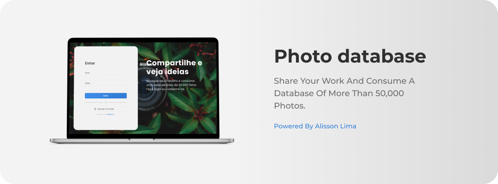

# Photo Database Login Page

Este projeto é uma página de login para um site de banco de imagens chamado Photo Database. Foi desenvolvido como uma prática para manipulação do DOM e o uso de formulários, utilizando HTML5, CSS3 com Sass e Javascript.

## Funcionalidades

- **Login:** Os usuários podem acessar a página de login e inserir suas credenciais.

- **Redirecionamento:** Após o login bem-sucedido, os usuários são redirecionados para uma página indicando que o login foi efetuado com sucesso.

## Tecnologias Utilizadas

- **HTML5:** A estrutura da página é construída utilizando HTML5 para uma organização semântica.

- **CSS3 com Sass:** A estilização da página é feita com CSS3, utilizando a extensão Sass para facilitar o desenvolvimento.

- **Javascript:** A manipulação do DOM e a lógica de formulários são implementadas com Javascript, proporcionando uma experiência dinâmica.

## Como Utilizar

### Rode o projeto em sua máquina

  1. Clone este repositório para o seu ambiente local.
  2. Abra o arquivo `index.html` no seu navegador.
  3. Insira suas credenciais na página de login.
  4. Após o login bem-sucedido, observe o redirecionamento para a página de sucesso.

### Acesse o link

  - Link: https://photo-database-loginform.vercel.app

## Contribuição

Este é um projeto pessoal, mas sinta-se à vontade para contribuir caso tenha sugestões de melhorias. Para contribuir:

1. Faça um fork do repositório.
2. Clone o repositório para o seu ambiente local.
3. Faça suas modificações e melhorias.
4. Envie um pull request.

## Autor

- Alisson Lima *All Work* - [alisson-lima](https://github.com/Alisson-Lima)
